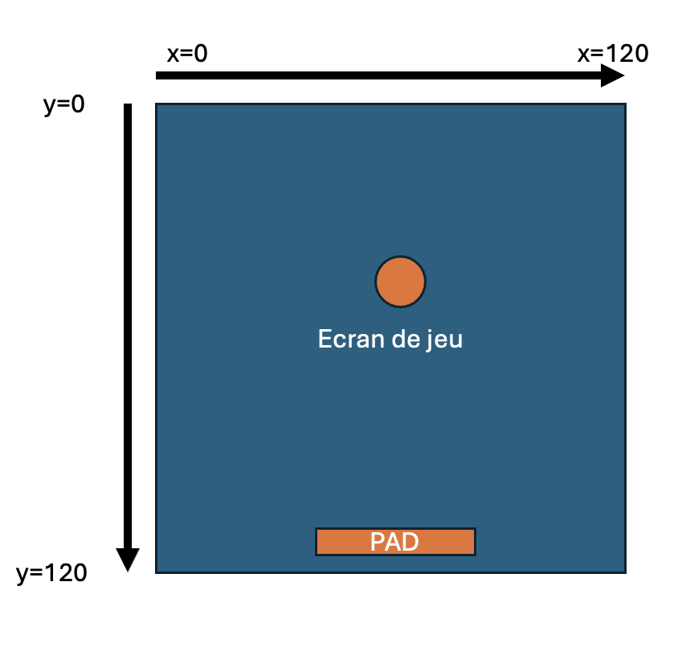
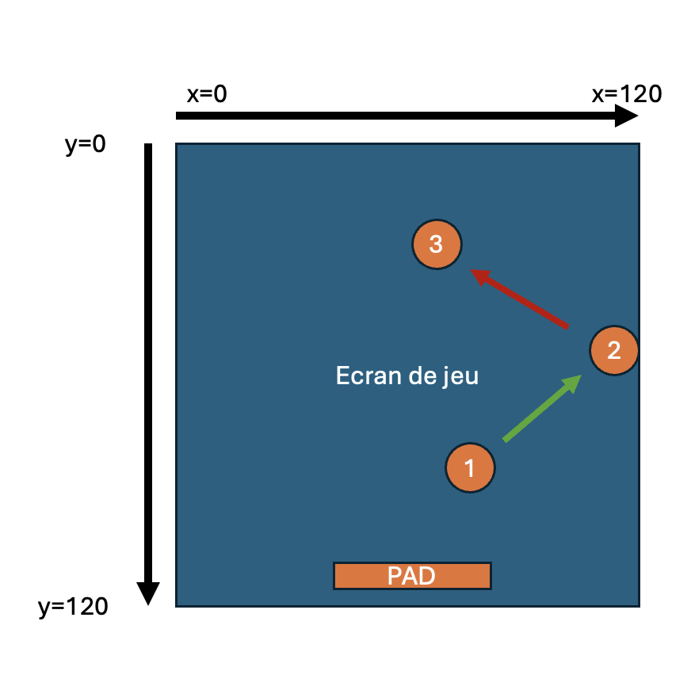
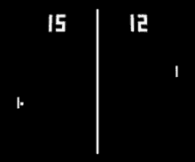

# Créer votre mini jeu

Vous êtes prêt à créer votre premier mini jeu

## Faire bouger le pad

Pour arriver à faire bouger le pad avec le clavier, nous devons  : 

- Déclarez une variable `padx` qui va nous permettre modifier la valeur de la position de notre pad sur l’axe des abscisses
- Utilisez une condition `if` pour modifier la valeur de `padx` lorsque l’on appuie sur la touche **`←`** du clavier

Retournez dans l’éditeur pour modifier le code

```python
# script:  python
padx=45
padw=30
padh=3

def TIC():
 global padx
  
 if btn(2):
	 padx = padx - 2
 cls()
 rect(0,0,120,120,10)
 rect(padx, 110, padw, padh, 12)
```

Vous pouvez maintenant retourner sur le terminal avec la touche **`ESC`** de votre clavier et taper la commande **`run`** pour lancer votre jeu

### Exercice 1 : Faites bouger le pad dans l’autre direction

En vous inspirant du code précédent, vous devez faire en sorte que le pad puisse bouger à droite comme à gauche

- Indice
    
    La fonction **`btn`** prend en paramètre un nombre ( 3 : flèche droite du clavier). Une page dans l’aide contient le tableau de correspondance avec les touches du clavier :  [https://github.com/nesbox/TIC-80/wiki/key-map](https://github.com/nesbox/TIC-80/wiki/key-map)
    
> QUIZ.A2.3 Lecture de documentation
> Avec TIC-80, si je souhaite avoir l'état des touches haut et bas du joueur 1, je dois utiliser dans mon code (2 réponses correctes)

* A. btn(0)
* B. btn(1)
* C. btn("up")
* D. btn("down")


### Exercice 2 : Limitez les mouvement du pad

Vous voulez maintenant améliorer les mouvements du pad en faisant en sorte qu’il reste dans le carré du jeu

- Indice
    
    Ajouter une condition supplémentaire dans votre `if` avec l’opérateur logique `and`
    

## Créer la balle rebondissante

### Exercice 1 : Dessinez  la balle

Vous allez utiliser la fonction  `circ` pour créer la balle au centre de l’écran, pensez à utiliser des variables `ballx` et `bally` pour pouvoir déplacer votre balle dans l’écran de jeu

- Indice
    
    vous pouvez aller consulter l’aide de TIC80 [https://tic80.com/learn](https://tic80.com/learn) et retrouver tous les paramètres de la fonction `circ` 
    

### Exercice 2 : Faire bouger la balle

Pour faire bouger la balle, vous allez modifier les coordonnées du centre :  `ballx` et `bally` 

Pour obtenir une trajectoire en diagonal (comme sur un billard), il faut modifier à chaque fois `ballx` et `bally` 

Tout d’abord essayez de faire bouger la balle en diagonal vers le haut et vers la droite en utilisant deux nouvelles variables `ballspeedx` et `ballspeedy`

- Indice
    
    
    

### Exercice 3 : Faire rebondir la balle

Pour faire rebondir la balle, vous devez inverser la direction de la balle en fonction de sa position à l’écran. 

si la balle se retrouve en limite avec la zone de jeu alors on simule une collision en inversant la vitesse de la balle sur l’axe sur lequel se trouve la collision



La balle est dans la position 1 et se dirige vers la position 2 en suivant la trajectoire verte dans ce cas la `ballspeedx = 2` 

Une fois arrivé au niveau de la bordure de la zone de jeu, sur notre schéma à la position `x=120` alors on inverse la vitesse de la balle et `ballspeedx = -2` 

- Indice
    
    Il faut penser à prendre en compte le rayon de la balle.
    
    Vous avez 3 cas à gérer, la bordure du haut, la bordure de droite et la bordure de gauche.

> QUIZ.A2.3 Le rebond
> Faites correspondre la vitesse initiale de la balle sur un axe avec la nouvelle vitesse de la balle sur ce même axe afin qu'elle reparte dans l'autre sens ?

- A. 0
- B. 2
- C. -5
- a. 5
- b. 0
- c. -2

## Gérer le respawn et la collision avec le pad

### Exercice 1 : Respawn

Lorsque la balle dépasse la limite de la bordure du bas de l’espace de jeu, elle continue à descendre pour ensuite disparaître. 

Vous allez devoir faire en sorte de la balle “respawn” au point de départ dès que la balle sort de l’espace de jeu par le bas

### Exercice 3 : gérer la collision avec le pad

Lorsque la balle se retrouve en collision avec le pad, vous allez devoir faire en sorte que la balle rebondisse sur le pad. Cette étape est importante car c’est à partir de ce moment la que votre jeu sera vraiment jouable

- Indice
    
    Utilisez une triple condition qui utilise les variables `ballx` `bally`  `padx`  `pady`  et `padw`   pour gérer la collision
    

## Ajouter une interface

### Exercice 1 : le score

Avec la fonction `print` et la fonction `str` , vous allez afficher le score à l’écran, la méthode de calcul est simple : plus 10 points à chaque fois que la balle rebondit sur le pad

- Indice
    
    Positionnez la fonction print à la fin de votre fonction `TIC()` pour que le score s’affiche au dessus de tous les autres élements
    
    Créez une nouvelle variable `score` que vous allez incrémenter dans la condition qui permet de faire rebondir la balle
    

### Exercice 2 : Life & game over

De la même manière que dans l’exercice précédent, créez un système de vie, avec 3 vies et un affichage dans l’interface en dessous du score. Lorsque le nombre de vie est égale à zéro alors replacez la balle à son point de départ, faites en sorte que la balle ne bouge plus et affichez “game over” au centre de l’écran

## Pour aller plus loin

Vous pouvez ajouter des nouvelles fonctionnalités de votre jeu comme un écran de  “high scores” qui s’affiche lors du game over comme dans les jeux retro et une option pour relancer le jeu pour tenter de battre “high scores”

Vous pouvez aussi créer un nouveau jeu en vous appuyant sur tout ce que vous avez appris dans ce coding club comme le célèbre jeu PONG à deux joueurs et pourquoi pas implémenter une IA pour jouer contre vous 



# Crédits

Cet atelier a été écrit et testé à Epitech Montpellier  💙 pour le Coding Club

Merci à Pico-8 Fanzine #1  pour l’inspiration grâce à ses tutos de création de jeux sur PICO-8 (la grande soeur de TIC-80)